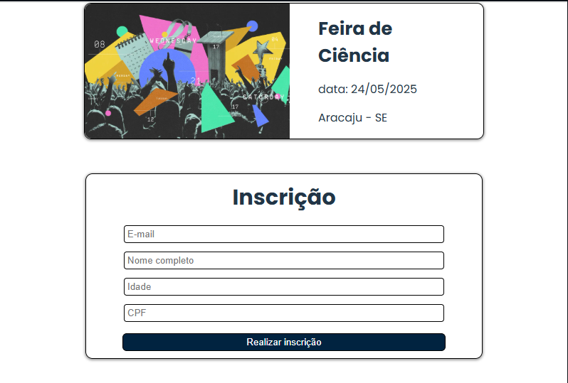

# Event Management System

A full-stack event management system that allows users to register for events and confirm their participation via email verification.

This project focuses on building a scalable backend using Node.js, integrating relational databases, and handling real-world workflows such as email confirmation and user validation.

---

## 📸 Screenshots

### 🖥️ Application Interface


### 📝 Event Registration



---

## 🚀 Features

* Event listing and filtering
* Event registration with user data
* Email confirmation using secure token (JWT)
* Confirmation and cancellation of registrations
* Backend structured with layered architecture
* Full containerization using Docker

---

## 🛠️ Tech Stack

### Backend

* Node.js (Express)
* MySQL
* JWT (authentication & validation)
* Nodemailer (email service)
* Google OAuth2 (secure email integration)

### Frontend

* React.js

### DevOps

* Docker
* Docker Compose

---

## 🧠 Architecture Overview

The backend follows a **layered architecture**, separating responsibilities into:

* **Controllers** → Handle HTTP requests and responses
* **Database Layer** → MySQL connection via connection pool
* **Services (implicit logic)** → Business rules inside controllers

This structure improves:

* Maintainability
* Scalability
* Code organization

---

## 🔐 Email Confirmation Flow

1. User registers for an event
2. Backend generates a JWT token (valid for 1 hour)
3. Token is stored in the database
4. Email is sent using Gmail OAuth2 via Nodemailer
5. User clicks confirmation link
6. Backend validates token and confirms registration

---

## 📡 API Endpoints

### Events

* `GET /eventos/listar` → List all events
* `GET /eventos/listarEspecifico/:id` → Get specific event

### Registration

* `POST /eventos/enviarConfirmacao` → Register user and send confirmation email
* `GET /eventos/ExibirInscricao/:id` → Validate token and render confirmation page
* `PATCH /eventos/confirmarInscricao` → Confirm registration
* `DELETE /eventos/cancelarInscricao` → Cancel registration

---

## 🐳 Running the Project (Docker)

### 1. Clone the repository

```bash
git clone https://github.com/your-username/event-management-system.git
cd event-management-system
```

### 2. Configure environment variables

Create a `.env` file inside `/backend`:

```env
MYSQL_HOST=db
MYSQL_ROOT_PASSWORD=root
MYSQL_DATABASE=eventos_db
MYSQL_PORT=3306

SECRET=your_jwt_secret

CLIENT_ID=your_google_client_id
CLIENT_SECRET=your_google_client_secret
REFRESH_TOKEN=your_refresh_token
```

---

### 3. Run with Docker Compose

```bash
docker-compose up --build
```

---

### 4. Access the application

* Frontend → http://localhost:5173
* Backend → http://localhost:3000

---

## 🗄️ Database

* MySQL 8 containerized
* Automatic schema initialization via `/docker-entrypoint-initdb.d`
* UTF-8 support configured

---

## 📦 Project Structure

```
backend/
 ├── controllers/
 ├── views/
 ├── db.js
 ├── app.js
 ├── server.js

Docker/
 ├── backend.dockerfile
 ├── frontend.dockerfile
 ├── db.dockerfile

docker-compose.yml
```

---

## 🎯 Key Highlights

* Real-world workflow: email confirmation system
* Secure token validation with JWT
* Integration with external services (Google OAuth2)
* Fully containerized environment
* Backend structured for scalability

---

## 📌 Future Improvements

* Add unit and integration tests
* Implement service layer abstraction
* Add authentication (login system)
* Improve error handling and logging
* Deploy to cloud (AWS / Azure / GCP)

---

## 👨‍💻 Author

Daniel Cardoso da Silva
Software Engineer (Full Stack)
